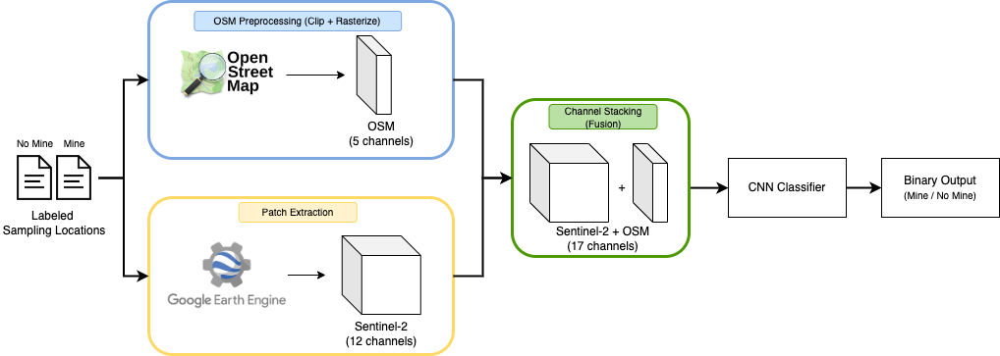

<h1 align="center">Artisanal Small-Scale Gold Mining Detection in the Amazon</h1>
<h3 align="center">Master Thesis – Information Studies 2024–2025</h3>

<p align="center">
  Detecting gold mining activity in the Bolívar region of the Amazon using Sentinel-2 satellite imagery and OpenStreetMap data.
</p>

<p align="center">
  
</p>

---

## Overview

This repository contains the code and analysis for my Master's thesis project focused on detecting artisanal and small-scale gold mining (ASGM) in the southeastern Venezuelan Amazon.

The project trains a deep learning model that analyzes Sentinel-2 image patches, enriched with contextual features from OpenStreetMap (OSM), to detect signs of mining activity in rainforest regions.

---

## Built On Top Of

This work builds upon the excellent [Earthrise Media Mining Detector](https://github.com/earthrise-media/mining-detector), an open-source pipeline for detecting mining scars in the Amazon.

---

## Repository Structure
```
data/
├── boundaries/               # Study region boundaries (GeoJSON)
├── sampling_locations/       # Mining / non-mining GPS points
├── tiles/                    # Sentinel-2 tile geometries (used for sampling logic)
├── contextual/               # OSM features
├── training_data/            # Generated Sentinel-2 (+ OSM) patches

gee/
├── get_training_data.py                     # Patch generation logic
├── gee.py                                   # Google Earth Engine wrapper
├── gee_pipeline.py                          # Full data processing pipeline
├── utils.py                                 # Utility functions
├── get_training_data.ipynb                  # Notebook for core patch generation
├── get_training_data_48px.ipynb             # Variant for 48×48 patches
├── get_training_data_random_negatives.ipynb # For generating random negatives

train_model/
├── train_model.py                           # Main model training script
├── train_model_class_imbalance.py           # Variant with class weighting

scripts/                                      # Helper scripts for preprocessing & utils

OSM_data.ipynb                                # OSM patch extraction and EDA
results_analysis.ipynb                        # Evaluation, plots, interpretability
project-logbook.md                            # Weekly updates and milestones
```

> ⚠️ Note: Some folders (like `data/training_data/` and `data/contextual/`) are not tracked in Git because they contain large generated files. You'll need to run the patch generation script and OSM_data.ipynb to populate them.

---

## How to use
1. **Extract OSM Features**  
   Run `notebooks/OSM_data.ipynb` to download and rasterize OpenStreetMap features.  
   ➜ Output is saved to: `data/contextual/`

2. **Generate Training Patches**  
   Use one of the patch generation notebooks:  
   - `gee/get_training_data.ipynb` (standard)
   - `gee/get_training_data_48px.ipynb` (for smaller patches)
   - `gee/get_training_data_random_negatives.ipynb` (for random negative sampling)  
   ➜ Output is saved to: `data/training_data/`

3. **Train the Model**  
   Choose a script from the `train_model/` folder to train your classifier:  
   - `train_model.py` for the base model  
   - `train_model_class_imbalance.py` if you're addressing class imbalance  

    Example:  
   ```bash
   python train_model.py --input_directory ... --output_directory ... --experiment_name ...
   ```

## License

This project reuses components from Earth Genome’s codebase, licensed under the [MIT License](https://github.com/earthrise-media/mining-detector/blob/main/LICENSE).

---

## Acknowledgements

Big thanks to the Earth Genome and Earthrise Media teams for providing the foundation for this work.  
Also grateful to my thesis supervisor for their guidance and feedback throughout the project.

---